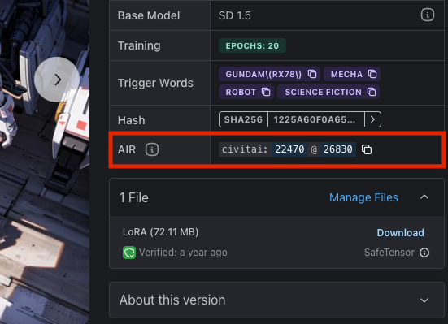

# AI Resource (AIR)

In response to challenges communicating what resource we intend for service providers and users to be using when testing out content, and in thinking ahead to how we believe AI Resources like those on Civitai, Hugging Face, and other platforms might be used, we propose a Uniform Resource Naming system, AIR (Artificial Intelligence Resource).

Here's the basic idea.

[About Uniform Resource Names](https://en.wikipedia.org/wiki/Uniform_Resource_Name)

## Spec

`urn:air:{ecosystem}:{type}:{source}:{id}@{version?}:{layer?}.?{format?}`

- `urn`: Uniform Resource Name
- `air`: Artificial Intelligence Resource (or maybe `arn` AI Resource Name)
- `{ecosystem}`: Type of the ecosystem (`sd1`, `sd2`, `sdxl`)
- `{type}`: Type of the resource (`model`, `lora`, `embedding`, `hypernet`)
- `{source}`: Supported network source
- `{id}`: Id of the resource from the source
- `{layer}`: The specific layer of a model
- `{format}`: The format of the model (`safetensor`, `ckpt`, `diffuser`, `tensor rt`)

### Examples

`urn:air:sd1:model:civitai:2421@43533`  
`urn:air:sd2:model:civitai:2421@43533`  
`urn:air:sdxl:lora:civitai:328553@368189`  
`urn:air:dalle:model:openai:dalle@2`  
`urn:air:gpt:model:openai:gpt@4`  
`urn:air:model:huggingface:stabilityai/sdxl-vae`  
`urn:air:model:leonardo:345435`

