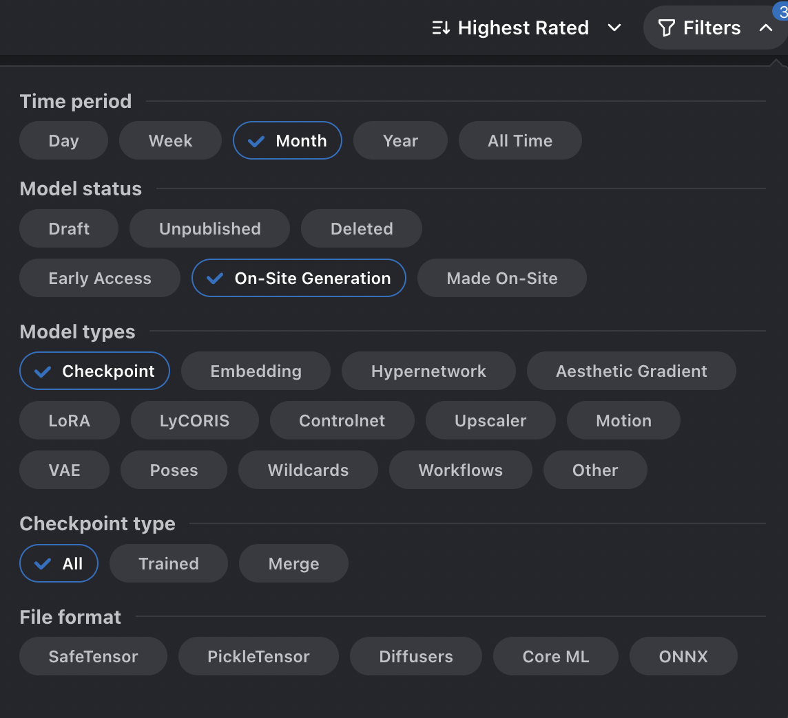

# Frequently Asked Questions

**Q: How do I get my user id?**

**A:** Using your **[API key](/docs/getting-started/setup-profile)**, you can make a request to the following endpoint.

```bash
curl --location 'https://civitai.com/api/v1/me' \
--header 'Authorization: Bearer <YOUR_API_KEY>' \
```

**Q: How can I find models that work with the SDK generator?**

**A:** The easiest way is to use the filters on the [models page](https://civitai.com/models). You can select "All Time", "On-site Generation", and "Checkpoint" to get a list of usable models.


_Filter on models page._

**Note:** Some versions of those models might not be usable. Be sure to check for a version of that model that works with on-site generation.

<!-- **Q: How do you filter NSFW through the SDK?**

**A:** -->

## Favorite SDXL Models

[Juggernaut XL](https://civitai.com/models/133005?modelVersionId=348913)

[SDXL Unstable Diffusers ☛ YamerMIX](https://civitai.com/models/84040/sdxl-unstable-diffusers-yamermix)
