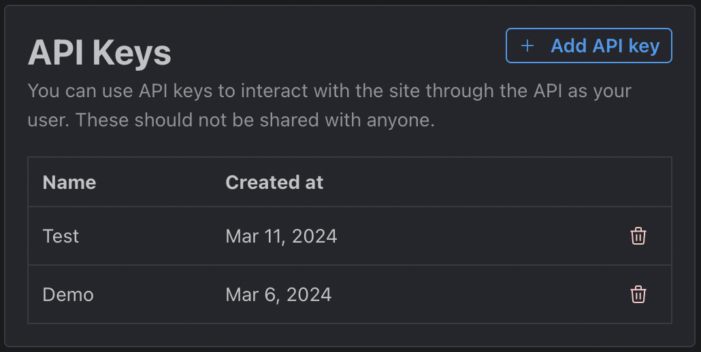

# Setting Up

## Create an API key

On [civitia.com](https://civitai.com/user/account) select your profile icon in the top right. In the dropdown you will see "Account settings". On this page you can generate a new API key. [^1]

_API key management section in profile._

## Turn on AI Resource Identifier

Also within the Account settings is a section called "Browsing settings". Within these settings we want to toggle on the [AI Resource Identifier](/docs/getting-started/ai-resource-identifier). In next section we will cover how to use this for image generation.

_Browsing settings toggles for AIR_

[^1]: The API key will work for the public API and the JavaScript SDK.
